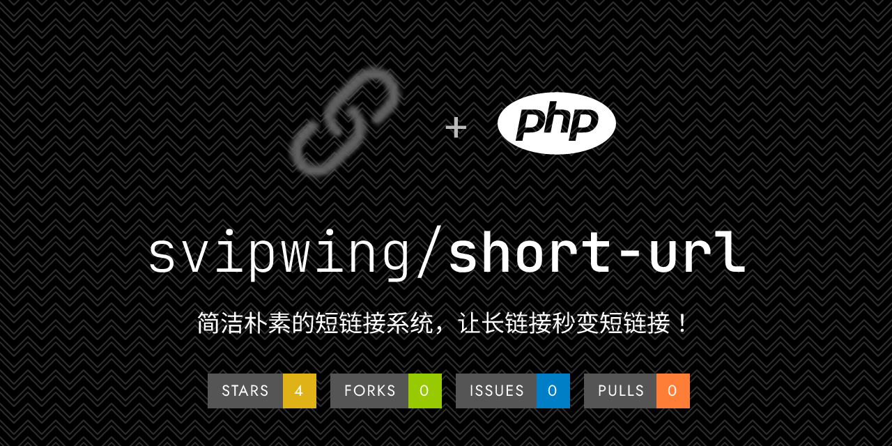

<h1 align="center">
  Short URL System
</h1>

  <a href="README.md">中文</a> | <a href="README-EN.md">English</a>

  A simple and elegant short URL system that turns long links into short ones in seconds!

  
  

#### Software Architecture

Built with PHP+MySQL, paired with jQuery and grid.css.

#### Installation Guide

0. Environment setup: phpmyadmin 4.9.7 (MySQL), php72  
1. Download the release version (if it hasn't been updated for a long time, pull the latest master branch from the repository as the source code and delete the `.git` directory), then extract it to your host.  
2. Fill in the configuration file `config.php` according to the comment instructions, ensuring the information is correct. Use a 32-bit lowercase md5.  
3. Access the installer `install/install.php`. When you see `Data tables created successfully! You can now start using it.`, the installation is complete. If an error occurs, refer to the first item in `Notes`.  
4. Delete the `install` directory to avoid security vulnerabilities.  
5. Access `new.php` to start using it. If an error occurs, reinstall.  

#### Notes
1. `config.php` is crucial and must be filled out correctly while ensuring its integrity.  
2. Complies with the GPL-3 license.  
3. It is recommended to purchase a shorter domain name for optimal results.  

#### Contributing

1. Fork this repository.  
2. Create a new Feat_xxx branch.  
3. Commit your code.  
4. Submit a Pull Request.